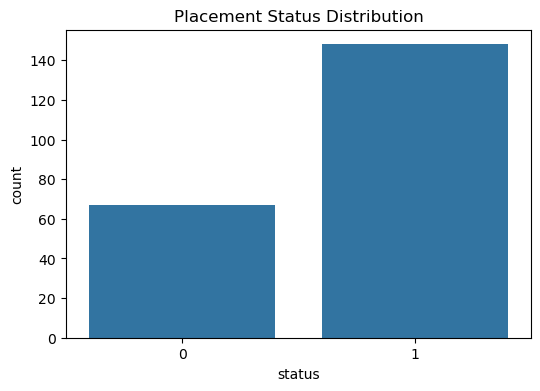

# Student Placement Analysis 🎓📊

## 📌 Project Overview
This project analyzes campus placement data to understand the factors
that influence whether a student gets placed or not.  
Exploratory Data Analysis (EDA) and a Logistic Regression model are used
to derive insights and predictions.

---

## 📂 Dataset
- Source: Campus Placement Dataset
- Records include:
  - Academic percentages (SSC, HSC, Degree)
  - Specialization, work experience
  - Placement status (Placed / Not Placed)

---

## 🔍 Exploratory Data Analysis (EDA)

### Placement Status Distribution

**Insight:**  
More students are placed than not placed, indicating a moderate class imbalance.

---

### Degree Percentage vs Placement

**Insight:**  
Students with higher degree percentages have a greater likelihood of being placed.

---

## 🤖 Machine Learning Model
- Model Used: **Logistic Regression**
- Target Variable: `status`
- Features: Academic scores, specialization, work experience

---

## 📈 Results
- The model successfully learned patterns from academic performance
- Degree percentage and work experience were strong predictors

---

## 🛠️ Tools & Technologies
- Python
- Pandas, NumPy
- Matplotlib, Seaborn
- Scikit-learn
- Jupyter Notebook

---

## 🚀 How to Run
1. Clone the repository
2. Open `notebook/student_placement_analysis.ipynb`
3. Run all cells

---

## 👩‍💻 Author
**Varshini Narra**  
Aspiring Data Scientist
